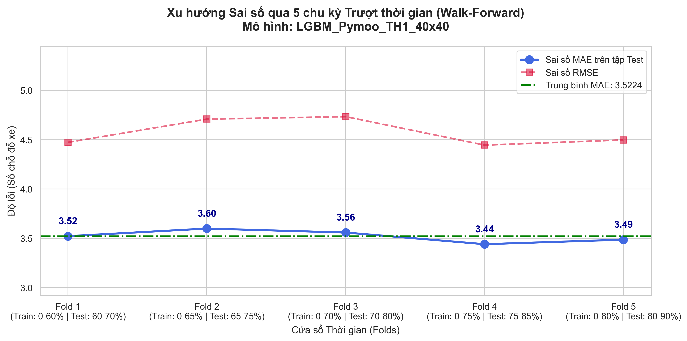
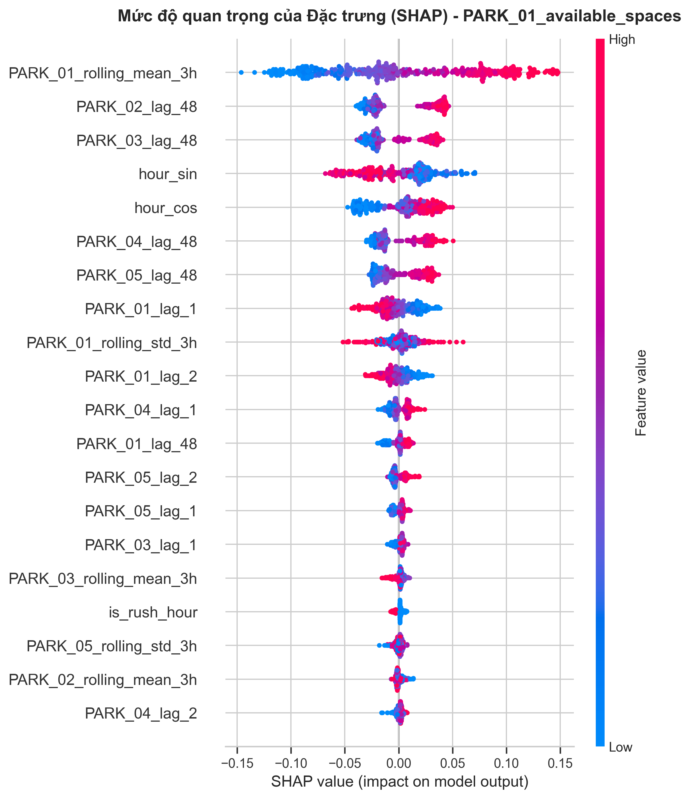
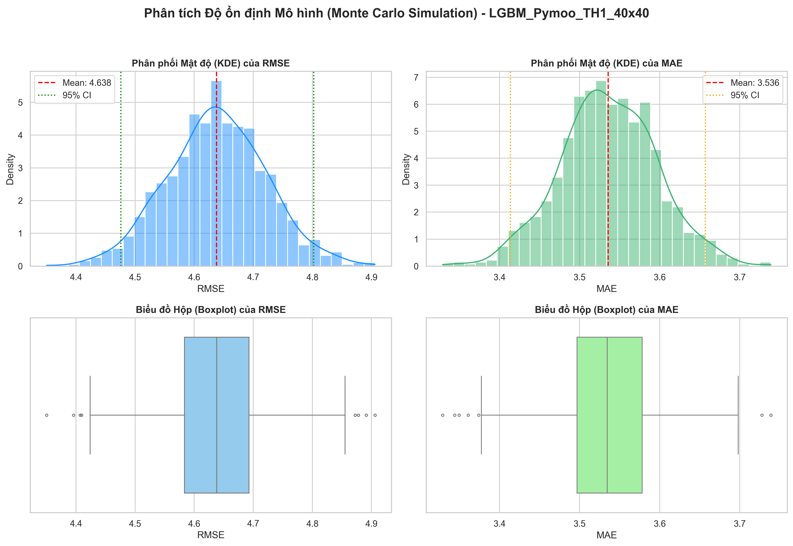

# 🚗 HỆ THỐNG GIÁM SÁT & DỰ BÁO CHỖ ĐỖ XE THÔNG MINH (PARK_01 - PARK_05)

## 📌 Giới thiệu Đề tài
Đồ án giải quyết bài toán dự báo chuỗi thời gian: **Dự đoán số chỗ đỗ còn trống sau 30 phút cho 5 bãi đỗ xe (PARK_01 đến PARK_05)**.
Mục tiêu là tối ưu hóa việc quản lý bãi đỗ, giảm thời gian tìm kiếm chỗ đỗ của người dùng và hỗ trợ hệ thống cảnh báo phân luồng tự động.

* **Thực hiện:** Lê Giáp Tuấn Sơn (Mã SV: 74DCTG21040)
* **Mô hình chính:** Thuật toán LightGBM kết hợp Thuật toán Di truyền (Pymoo) để tự động hóa việc tinh chỉnh siêu tham số.
* **Kỹ thuật đánh giá & Giải thích:** Áp dụng Rolling Window (Walk-Forward Validation) để kiểm định độ ổn định, kiểm định Monte Carlo cho độ ổn định siêu tham số và sử dụng thư viện SHAP để giải thích quyết định của mô hình.
* **Giao diện:** Ứng dụng Web trực quan được xây dựng bằng Streamlit.

---

## 📊 Kết Quả Đánh Giá Mô Hình (Sau Tối Ưu)
Mô hình LightGBM tối ưu đạt hiệu năng xuất sắc trên tập dữ liệu kiểm thử:
* **MAE (Sai số tuyệt đối trung bình):** 3.53 chỗ đỗ
* **RMSE (Sai số căn phương trung bình):** 4.63 chỗ đỗ
* **R² Score (Độ tin cậy):** 91.66%

---

## 🖼️ Kết Quả Trực Quan

### 1. Walk-Forward Validation (Rolling Window)
Kiểm định độ ổn định mô hình theo thời gian trên từng cửa sổ trượt:



### 2. Phân tích SHAP — Giải thích quyết định của mô hình
Ảnh hưởng của từng biến (giờ trong ngày, ngày trong tuần, thời tiết...) lên dự báo số chỗ trống tại mỗi bãi:



### 3. Kiểm định Monte Carlo — Độ ổn định siêu tham số
Tối ưu siêu tham số bằng thuật toán Di truyền (Pymoo) trên nhiều lần khởi tạo ngẫu nhiên:



---

## 📂 Cấu Trúc Mã Nguồn
```text
└── DOANHOCMAY/
    ├── DAHM.ipynb               # Notebook chứa toàn bộ quy trình: tiền xử lý, huấn luyện, tối ưu Pymoo và phân tích SHAP.
    ├── app.py                   # Mã nguồn giao diện Web Dashboard (Streamlit).
    ├── demo_data.csv            # Bộ dữ liệu mẫu (100 chu kỳ gần nhất) dùng để mô phỏng thực tế.
    ├── SV27_processed_final.csv # Dữ liệu đã xử lý dùng cho dashboard (app.py).
    ├── lgbm_pymoo_TH1.pkl       # File mô hình LightGBM đã được huấn luyện tối ưu.
    ├── scaler_X.pkl             # File chuẩn hóa dữ liệu đầu vào.
    ├── scaler_y.pkl             # File chuẩn hóa dữ liệu đầu ra.
    ├── feature_cols.pkl         # Danh sách các biến đầu vào.
    ├── target_cols.pkl          # Danh sách các biến mục tiêu (5 bãi đỗ).
    ├── images/                  # Các ảnh kết quả (Rolling CV, SHAP, Monte Carlo).
    └── requirements.txt
```

---

## 🚀 Chạy Ứng Dụng

```bash
# 1. Cài dependencies
pip install -r requirements.txt

# 2. Chạy dashboard Streamlit
streamlit run app.py
```

Mở trình duyệt tại `http://localhost:8501` để sử dụng dashboard.

> **Ghi chú:** Các artifact trung gian (ảnh `.tiff` gốc, baseline models, model so sánh) được giữ ngoài repo qua `.gitignore` để repo gọn gàng; bạn có thể sinh lại bằng notebook `DAH.ipynb`.
